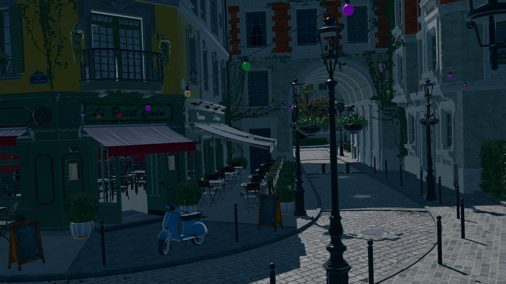

# GPU Driven Renderer

[Bistro scene](https://github.com/NVIDIA-RTX/RTXGI-Assets) as seen from the default camera and lit by
[Day Sky HDRI](https://ambientcg.com/view?id=DaySkyHDRI066B) environment map, with a directional light rotation 
modified to match the cubemap (`--sun_direction -111.432;89.726;-56.784`). 


C++20/Vulkan GPU-driven renderer focused on modern real-time rendering architecture.
Implements visibility buffer rendering, GPU-side visibility culling, Hi-Z occlusion culling, indirect draw generation, 
bindless-style resource access, textures support, and meshlet (cluster) rendering experiments 
(meshlets occlusion culling, cone culling, etc.).

Rendering features include:
* GLTF models and materials loading, with metal-roughness (primary) and spec-gloss (lossy) PBR pipelines support. 
Texture loader supports both DDS textures, with bundled mipmaps, and PNG/JPEG/WEBP images (via SDL_image library), but 
with no automatic mipmaps generation. While masked geometry is somewhat supported, transparencies (i.e. blending, 
KHR_materials_transmission, KHR_materials_ior, KHR_materials_volume) are not properly rendered.
* Image-based PBR lighting by a single environment map + one directional light. Environment map is hackingly clamped to 
max brightness of 10 to avoid double-sun lighting issues.
* Directional light casts Cascaded Shadow Maps (4096x4096x4 cascades) with tight frustum fitting.

## Building

```cmake
git clone --recursive https://github.com/Retro52/gdr
cd gdr

cmake -S . -B build
cmake --build build --target gdr
```

## Running
```bash
cd build
./gdr /path/to/gltf/scene
./grd --instances 1000 /path/to/gltf/mesh 
```

## Compatible GPUs:

Mesh shading is not required to run the program, although the performance is better with it.
However, the following Vulkan capabilities are required by default:

* 8-bit integer storage buffer access
* 16-bit storage and uniform buffer types
* Indirect drawing
* Dynamic rendering
* Min/max sampler reduction mode
* Bindless textures (partially bound descriptors, variable descriptor counts, and non-uniform indexing)
* Scalar block layout
* Synchronization2
* Anisotropic filtering

Any Turing, RDNA 2, or newer GPU should run without issues. 
Older generations, such as RDNA 1 and Pascal, might also support the required features, 
but they are untested due to lack of access to such hardware.

## License

MIT License. Portions of the fiber platform code (`src/job/fibers/platform/posix/`) are derived from [Google's Marl](https://github.com/google/marl) and are licensed under Apache-2.0. See [third party notice](THIRD_PARTY_NOTICES) for details.
